# Surveys and Survey Experiments with Qualtrics

In this chapter, we will go from using data that someone else collected to collecting data of our own using Qualtrics. Qualtrics makes collecting survey data online easy. If you have ever used something like Google Forms, it is, in many respects, quite similar, except that it is much more powerful. As you will see, we can quickly and easily build a survey experiment, administer the experiment, download the results, and import them into R. Let's get started!

## Creating a Qualtrics account
Stanford is kind enough to provide all of us with access to Qualtrics. Navigate to https://uit.stanford.edu/service/survey to get started. 

******

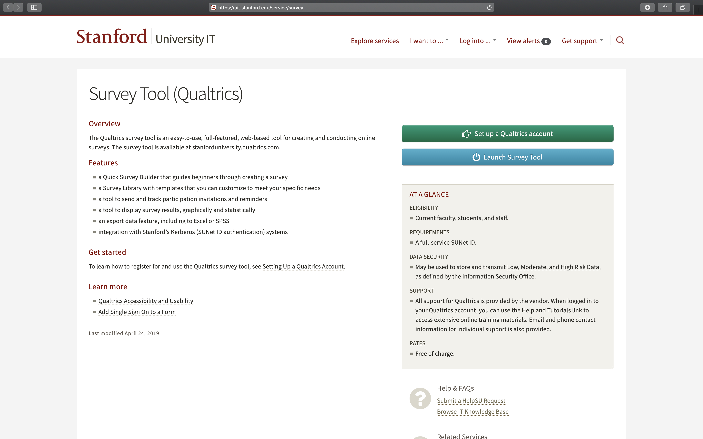

******


Click on the big, green "Set up a Qualtrics account" button and it will tell you to go to https://stanforduniversity.qualtrics.com. Go to that link!

******

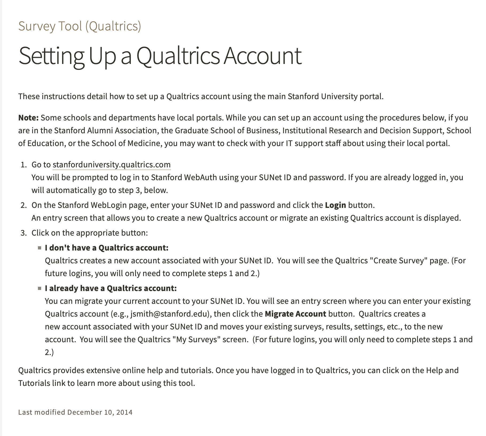

******

There, it will ask if you have a preexisting Qualtrics account or not. Click the button that pertains to you. If you don't have a preexisting account, it will either prompt you to log-in to your Stanford account via WebAuth, or else it will automatically log-in for you and set up your account if you are already logged in.

******

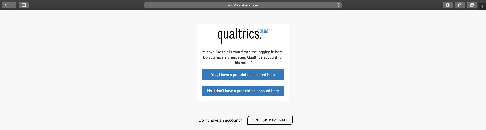

******

Now you should be into Qualtrics! Since you haven't made a project previously, you only have one option: Create new project. Everytime you want to make a new survey you will click this button. We will make an example survey to show you the ropes. 

******

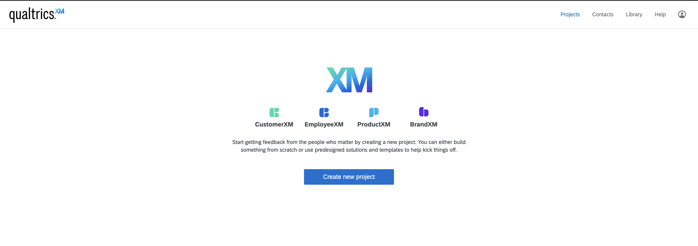

******

It will bring you to a page with a bunch of options for creating a new survey. You can start from these pre-designed surveys if they fall in line with the kind of survey you want to run. There are even pre-built surveys for academics. For learning purposes though, we will start from scratch by clicking "Create your own".

******

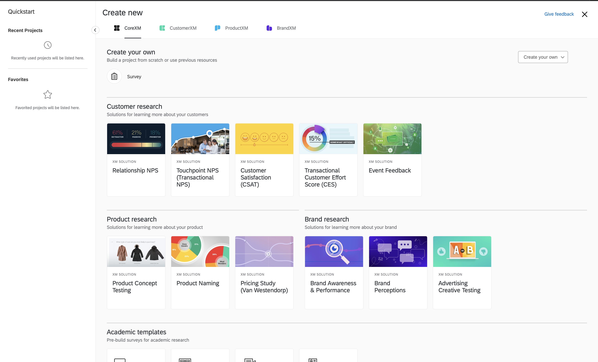

******

Now it asks us to name our project. I called it Trial Survey. 

******


******


## Building a survey

With a project created, we have been ported to Qualtric's main user interface, where we can build a survey. Have a look around at all of the different options. Qualtrics is full of tools for creating your ideal survey, but at times that functionality can be a bit overwhelming. 

******

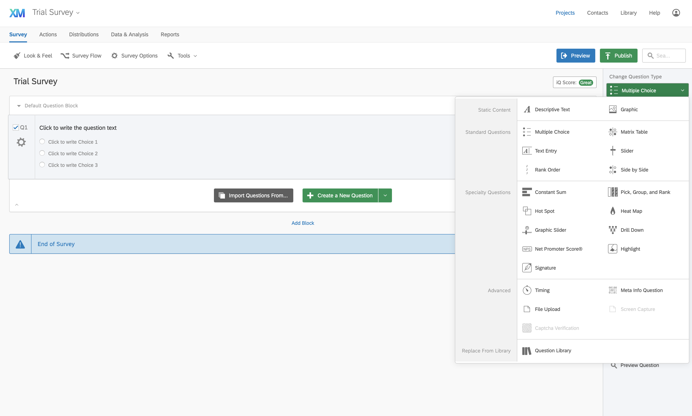

******

We will start simple. Let's start by learning how to add a question to our survey. Click the button that says "Text Entry" on the far right side of the interface. It should pull up the following menu. 

******

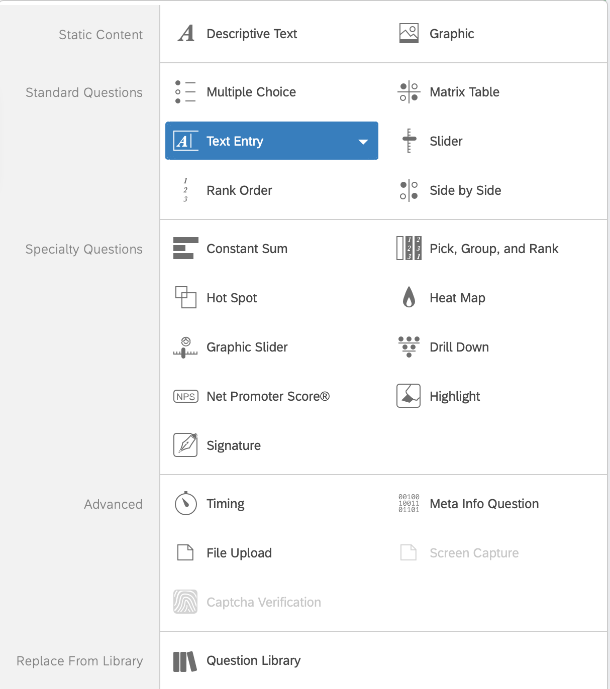

******
 
There are a bunch of options and I recommend experimenting/reading up on all of them. The most essential are Text Entry, Multiple Choice, and Matrix Table. Our first question will use Text Entry. It allows us to ask a question and then have the user put in any value that they like. Multiple Choice on the other hand would let us specify the answers they can provide. For a question like -- How old are you? -- there are too many potential responses for multiple choice to work well, so text entry will do. 

We can change the text at the top of the question box to specify the question the respondent should answer. For example:

******

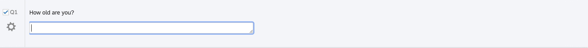

******

Next let's make a more complicated multiple choice question using the matrix table. It basically allows you to ask multiple multiple choice questions at once. 

******

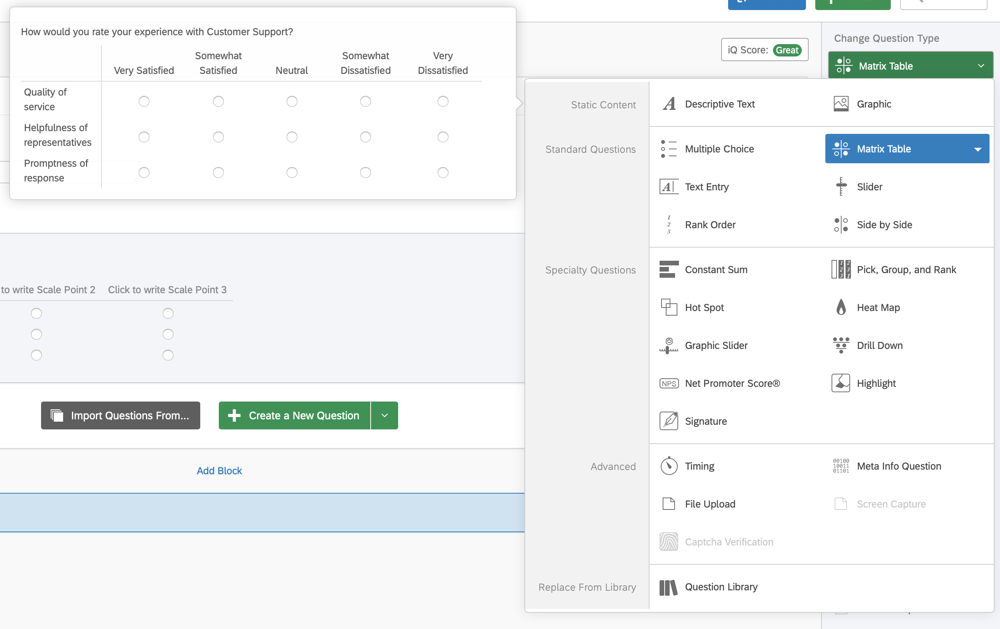

******

For example, we can copy a question from the GSS about trust in institutions to see the extent to which our respondents trust different groups, like their family or the government.  

******

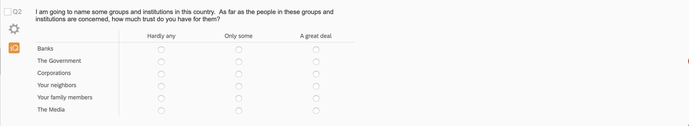

******

Cool! Maybe trust of this sort varies by income - we might expect rich people to support institutions more than the poor, for example, because they have historically benefitted from them.

******

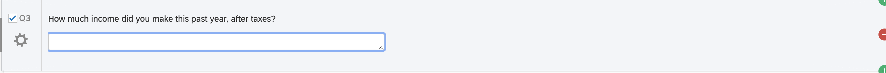

******

But what if they ignore the question and put in something other than their income into the question response? How do we make sure they answer in the way that we want them to? We can use validation for that. On the right hand side, below the question type, we can see a bunch of options for each question. Look for the area that says Validation Type. Click Content Validation. It will produce subsidiary options under Content Type. We can click Number to make sure that the respondents put a number in the text box! 

******

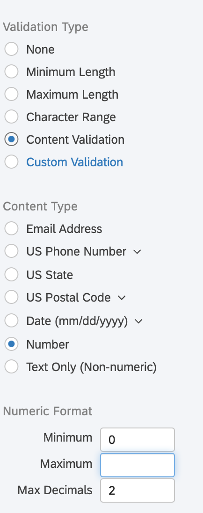

******

If we want to put the income question after age, we can simply drag it upwards so that it comes before the question on trust. 


******

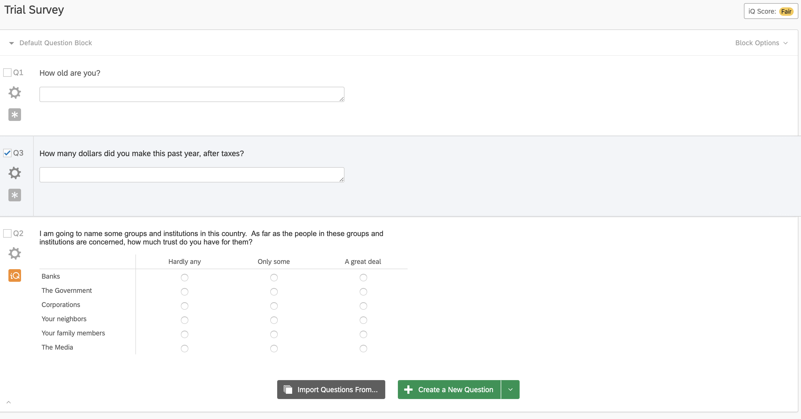

******

We don't have to come up with all of the questions ourselves - Qualtrics has a question bank that you can use to find pre-written questions. Just click on the "Import Questions from.." button at the bottom of the page. 

******


******

I found one in the Survey Library -> Qualtrics Library -> Higher Education section about the quality of your professors... how would you rate us?

******

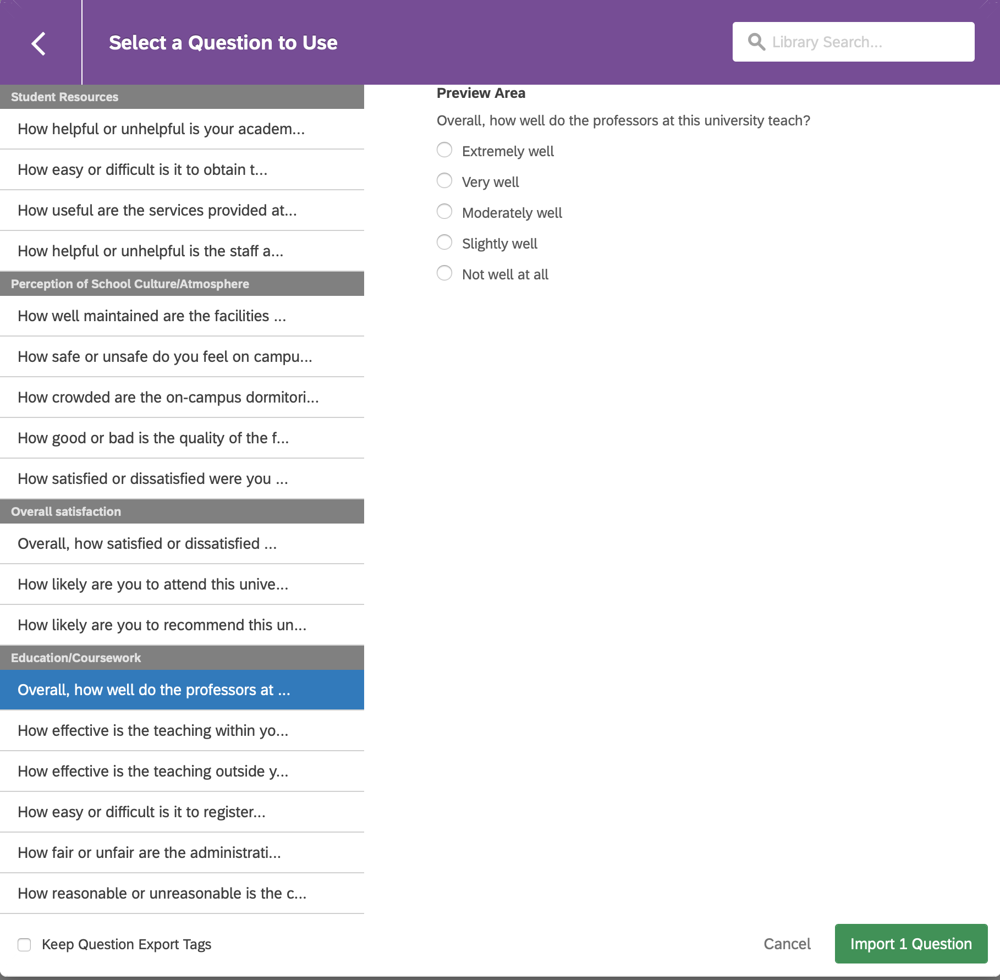

******

Cool, we have created a completely nonsensical survey, but that's okay. 

## Survey options

Let's say you want to edit some meta-options about the survey and how it behaves, for example, whether respondents can go backwards to previous questions or not. Click the "Survey Options" button near the top of the page and it will pull up a bunch of selections you can make and attributes you can change about the survey. 

******


******

"Look and Feel" will let you change how your survey looks, though probably not how it feels.  

******

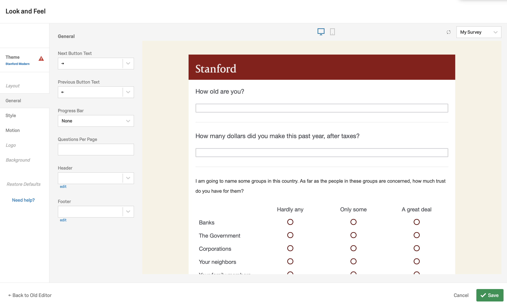

******

## A quick survey experiment

To set up a survey experiment, we have to set up a block of questions from which respondents will only get one of the N questions in the block. This selection is randomized, so that we can see how the randomization affects their responses. Here is a quick example. 

First add a new block:

******

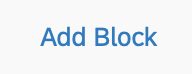

******

Now we have two blocks:

******

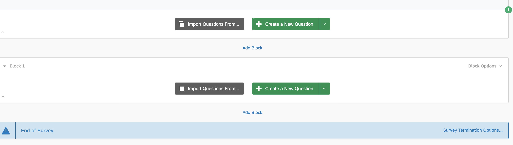

******

Now add the two different versions of the survey prompt to the block. Here I took a question from a survey about how Americans respond to hostage crises. 

******

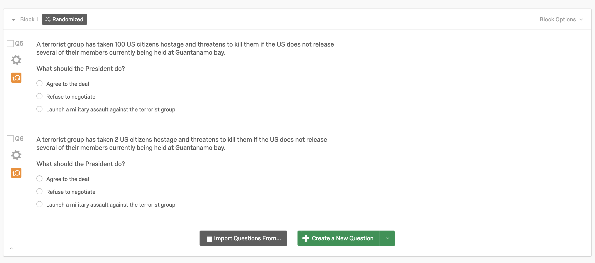

******

The last step is to make sure that the questions from this block are sampled randomly for each respondent, and that only one of these questions will be selected. We can achieve this by editing the block's options. Click block options like so and select the Question Randomization option:

******

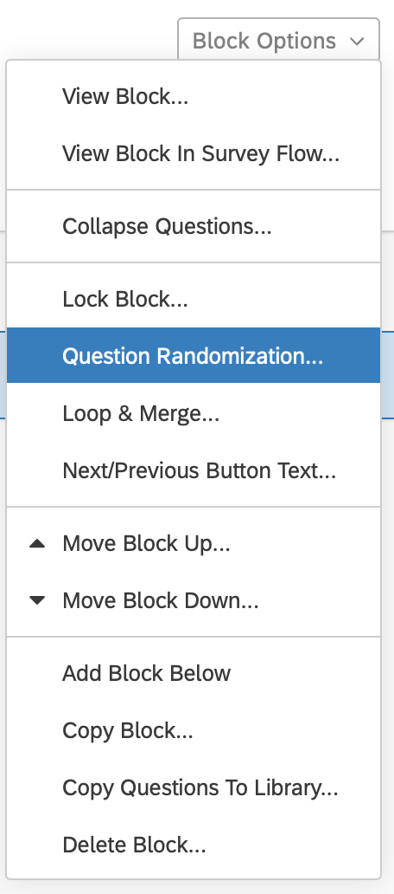

******

This should pull up the Question Randomization menu. We can choose: no randomization, to randomize the order of questions, or to randomly select N questions from the block to present to the respondent. Select the last optin and set the number to 1 and we will have our first survey experiment.

******

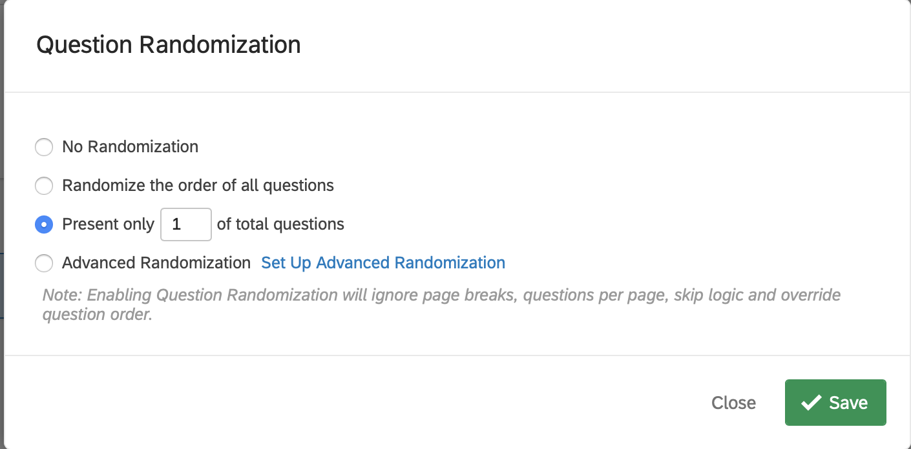

******

## Publish and Distribute

You can try out your survey by pressing the blue "Preview" button at the top. Or if you are ready, press the green "Publish" button. 
Once it is published, we can distribute it to respondents. We could do this on Mechanical Turk, as we will learn in a later class, or we can just send it to our friends, as I want you to do for this week's lab. To do that click on the "Distributions" tab at the top of the survey. It will ask how you want to distribute your survey.

******

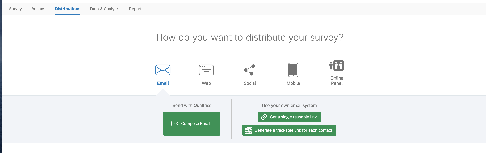

******

You can do it by email, or by my preferred way, which is to "Get a single reusable link" which you can send to anyone who you want to take your survey. You can also generate a trackable link for each respondent if you want to keep track of who responded. 

******

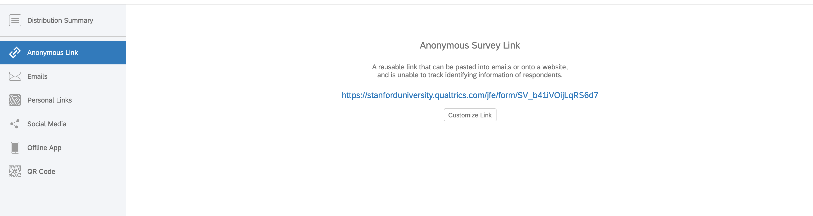

******

Let's follow the link and fill it out ourselves. 

******

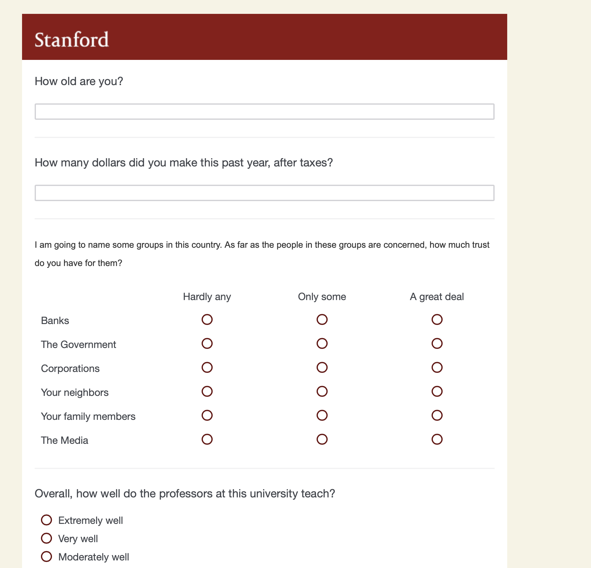

******

Once you complete both pages, you will be sent to the completion page. 

******

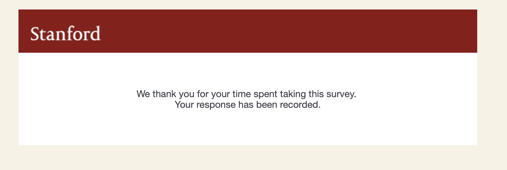

******

Now inside the Data and Analysis pane in Qualtrics, you should see a response!


******

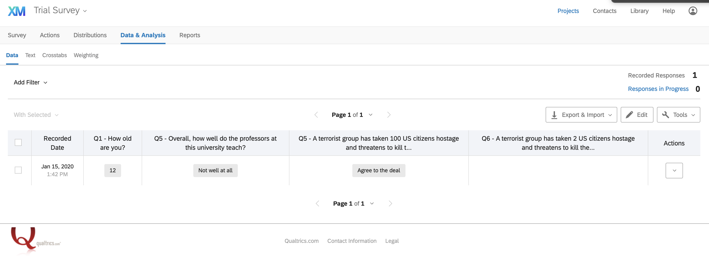

******

We can export it using the "Export & Import" data button and then clicking Export Data. Doing so will pull up this pane. 

******

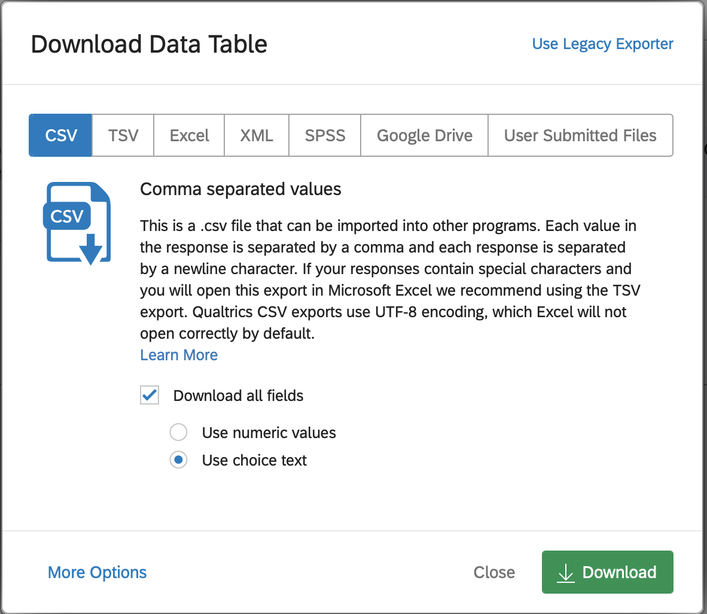

******

Export it as a .csv because those files are super easy to load into R. It will download a .zip file to your computer. Once you unzip it, you will be able to load the resulting file into R. First, I would rename it, so that it is easy to input into R. I called the file trial_survey.csv. Drag it to your R project and then you can load it into R using the read.csv() function. Simple!

```{r}
survey <- read.csv("Data/trial_survey.csv")
```

Cool - what does it look like? 
```{r}
head(survey)
```
 Looks great except for the second row! Let's drop that and then you will be ready to analyze it using the tools from last class.
 
```{r}
survey <- survey[-2,]
head(survey)
```
